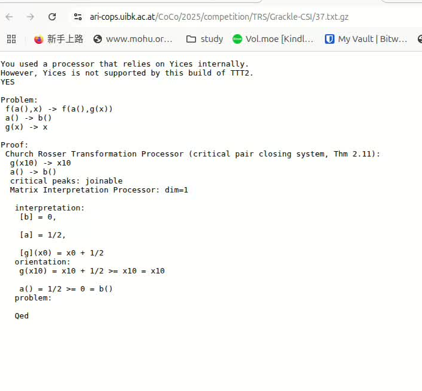

# Grackle-CSI in CoCo2025

Grackle-CSI solves the largest number of problems in [CoCo2025](https://project-coco.uibk.ac.at/2025/).
CoCo is the annual confluence competition for rewrite systems.

Rewrite system is tightly related with lambda calculus and Alan Turing and Alonzo Church's research on computability theory.

Grackle-CSI uses machine learning techniques to automatically strategies for confluence tool CSI.

## Results

**Results of CoCo competition**.
It contains 100 term rewrite systems (TRSs) randomly chosen from the ARI-COPS database.
| Solver | YES | NO | Total | Rank |
| ---- |-----|----|-------|------|
| Grackle-CSI | 50  | 34 | 84    | **1st** |
| CSI    | 51 | 33  | 84 | **1st** |
| ACP    | 48 | 26| 74   | **3rd** |

**Results of CoCo's full run**.
The timeout is one minute.

| Solver | YES | NO | Total | Rank |
| ---- |-----|----| ------|------|
| Grackle-CSI | 277  | 206 | 483     | **1st** |
| CSI    | 272 | 205  | 477 | **2nd** |
| ACP    | 257 | 164 | 421  | **3rd** |

**Results of CoCo's full run 10min**.
| Solver | YES | NO | Total | Rank |
| ---- |-----|----| ------|------|
| Grackle-CSI | 277  | 206 | 483     | **1st** |
| CSI    | 274 | 205  | 479 | **2nd** |
| ACP    | 258 | 168 | 426  | **3rd** |


During the competition, Grackle-CSI only gets the first place in the non-confluence analysis (NO category) since it sometimes output warnings as shown in the screenshot below. 
However, the answer is only acceptable in CoCo's statistics when the first line of output is YES or NO.

<div align = "center">

</div>


## Run

The statistics shown in the repo will not ignored the proofs when there are warnings.
The logs of problem solving are downloaded from [CoCo25's full run statistics](https://ari-cops.uibk.ac.at/CoCo/2025/full-run/TRS/) and [CoCo25's FUll competition statistics](https://ari-cops.uibk.ac.at/CoCo/2025/full-run/TRS/).

To obtain the statistics, run

`python coco2025.py --results_dir coco2025-competition/  --stats_file  coco2025_competition_stats.json`

`python coco2025.py --results_dir coco2025-full/  --stats_file  coco2025_full_stats.json`

`python coco2025.py --results_dir coco2025-full-10min/  --stats_file  coco2025_full_10min_stats.json`

## Reference


[Automated Strategy Invention for Confluence of Term Rewrite Systems](https://arxiv.org/abs/2505.07270). Liao Zhang, Fabian Mitterwallner, Jan Jakubuv, Cezary Kaliszyk. IJCAI 2025.

```
@article{zhang2024automated,
  title={Automated Strategy Invention for Confluence of Term Rewrite Systems},
  author={Zhang, Liao and Mitterwallner, Fabian and Jakubuv, Jan and Kaliszyk, Cezary},
  journal={IJCAI},
  year={2025}
}
```